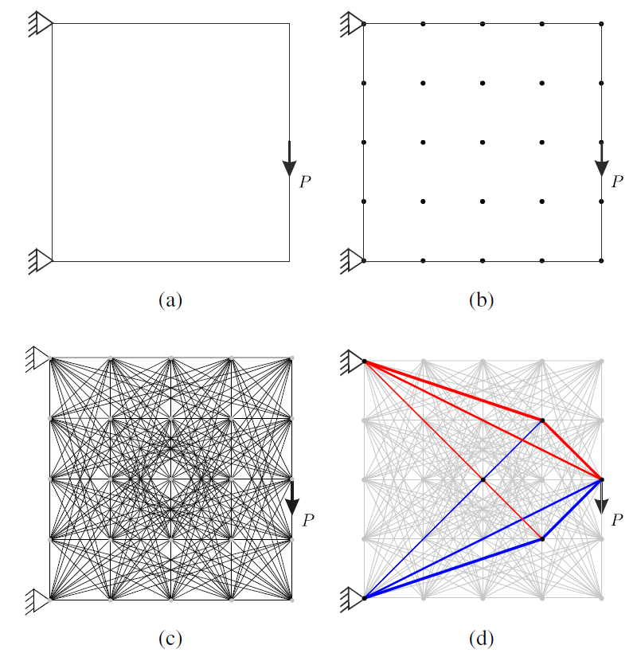

# Key concepts

In this chapter we share a Python script that provides a numerical layout optimization.  
An easy to use online version is [LayOpt](https://www.layopt.com/truss), which is a bit of a black box for the user. Here we adapt the script provided in the following [He *et al.*, 2019](https://link.springer.com/article/10.1007/s00158-019-02226-6) $^1$ and explain how the optimization process works. It incorparates an efficient adaptive member adding scheme for 2D and 3D problems subject to multiple load cases.

## Using the optimization script
To use the optimization script we need to follow a couple of steps:

**Step 1:** Define the design domain and the load and support conditions, Figure(1a). 

**Step 2:** Discretize the design domain, Figure(1b). We will begin manually defining a set of nodes. Later we will introduce how to define a grid of points over a design space.

**Step 3:** Connect the nodes to create a ground structure, Figure(1c). This means we create all possible members between the nodes. We start to do this mannualy and later introduce functions that do this for us.

**Step 4**: Solve the optimization problem, Figure(1d)

**Figure 1:** problem description \[He *et al.*, 2019\] 

## Formulation of the optimization problem

Steps 1-3 will be explained in the examples. Step 4: The optimization itself, is already fully coded in the script and here we explain some key concepts of what it is doing. If you are interested you can dive deeper into the code itself with the help of this paper

The optmization problem minimizes the volume of the total structure with as constraints the cross sections being larger than zero and the internal member forces being in between defined stresses.
The formulation is:

$$
minV = l^T a
$$

$$
s.t.
$$

$$
B q = f
$$

$$
q \ge - \sigma^- a
$$

$$
q \le \sigma^+ a
$$

$$
a>=0
$$

Where: 
 
$V$ is the structural volume.  
$a = [a_{1}, a_{2}, ..., a_{m}]^T$ is a vector containing the cross-section areas.  
$m$ denotes the number of members.  
$l = [l_{1}, l_{2}, ..., l_{m}]^T$ is a vector containing the length of the members.  
$\boldsymbol{B}$ is a $2n \times m$ equilibrium matrix.  
$n$ denotes the number of nodes.  
$\boldsymbol{q}$ is a vector containing the internal member forces.  
$\boldsymbol{f}$ is a vector containing the external forces.  
$\sigma^-$ and $\sigma^+$ are the limiting tensile and compressive stresses, respectively.

The equilibrium matrix $\boldsymbol{B}$ is assembled using $\boldsymbol{B}_{i}$ matrices for every member $i$ interconnecting nodes $I$ and $II$.
$B_{i}=[\frac{-X_{i}}{l{i}}, \frac{-Y_{i}}{l{i}}, \frac{X_{i}}{l{i}}, \frac{Y_{i}}{l{i}}]$, where $X_{i}=x_{i}^{II}-x_{i}^{I}$ and $Y_{i}=y_{i}^{II}-y_{i}^{I}$ the projected length $l_{i}$ in the $x$ and $y$ axis directions respectively. 

## Problem extensions

Different problem extensions are already implemented in the script. The problem extensions are joint cost, multiple load cases, an adaptive member adding scheme and an extension to 3D problems. 

**Joint cost**

An arbitrary extra cost $s$ is added for every member in the vector containing the member length resulting in the following vector $\bold{l}=[l_{1}s,l_{2}s, ..., l_{m}s ]$. With this joint cost we can steer the result to prevent very complex trusses with many small members. 

**Multiple load cases**

The problem can be extended to include multiple load cases. The equilibrium constraint becomes:

$$
\boldsymbol{B} \boldsymbol{q}^k = \boldsymbol{f}^k, \text{ for } k=1, 2, ..., p
$$

**Adaptive member adding scheme**

The adaptive member adding scheme is used to reduce the computation time. It is possible to initially only use a reduced set of members to solve the problem. Remaining members are added until an additional constraint is satisfied. Watch out that you don't remove too many members from the initial set. If the initial set cannot form a sensible truss to carry the load the algorithm fails. This happens for example if you don't include any diagonal members.

To implementat the adaptive member adding scheme, the main function of the ``trussopt.py`` the ``stopViolation`` function checks if the summed maximum virtual strain $\epsilon_{i}$ of member $i$ is smaller than 1. The potential member that most violates this constraint is added to the member set. This member adding process continues untill no more violations are detected. The derivation of this constraint can be found in the paper $^1$ and results in:

$$
\epsilon_{i} = \sum_{k=1}^{P} \frac{max (\sigma^+\boldsymbol{B}^T_{i}\boldsymbol{u}^k_{i})}{l_{i}} \le 1,\\
$$
$$
(\text{for}\ i = 1, ..., m)
$$

**3D problems**

The main function in ``trussopt.py`` already requires you to enter the geometry in 3D. Only for the plotting an extra package is needed.

## References

[1] L. He, M. Gilbert, X. Song, "A Python script for adaptive layout optimization of trusses", Struct. Multidisc. Optim., 2019.
